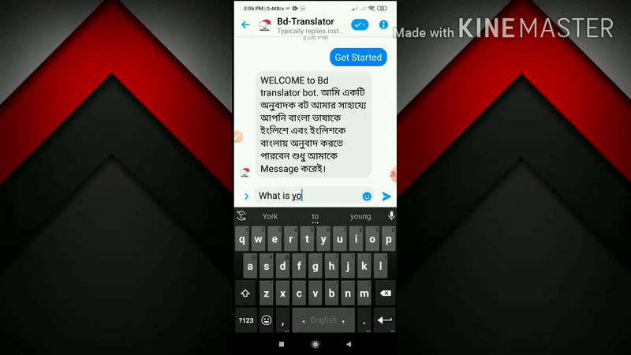

# BD Translator - Facebook Messenger Translation Bot

A Facebook Messenger bot that provides real-time translation services between Bengali and English. This bot allows users to send messages in either language and receive instant translations.

## Demo



## Features

- Automatic language detection
- Instant translation between Bengali and English
- Simple and intuitive user interface through Facebook Messenger
- Quick response time
- Additional media sharing capabilities

## Technologies Used

- Node.js
- Express.js
- Facebook Messenger Platform API
- Google Translate API (via node-google-translate-skidz)
- Webhook integration

## Installation

1. Clone the repository:

```bash
git clone https://github.com/yourusername/bd-translator.git cd bd-translator
```


2. Install dependencies:

```bash
npm install
```

3. Set up environment variables:
- `PAGE_ACCESS_TOKEN`: Your Facebook Page access token
- `VERIFY_TOKEN`: A token to verify webhook requests
- `PORT`: (Optional) Port to run the server on (defaults to 3000)

4. Start the server:

```bash
npm start
```


## Facebook Messenger Setup

1. Create a Facebook Page and Facebook App
2. Configure the Messenger platform in your Facebook App
3. Set up webhooks to point to your server URL
4. Generate and configure Page Access Token

## Usage

Users can interact with the bot by sending messages to your Facebook Page. The bot will:

1. Automatically detect the language of the message
2. Translate Bengali messages to English
3. Translate English messages to Bengali
4. Send the translation back to the user

## Development

The main application logic is in [index.js](cci:7://file:///home/saiful/work/bd-translator/index.js:0:0-0:0). Key functions include:

- [receivedMessage()](cci:1://file:///home/saiful/work/bd-translator/index.js:73:0-118:1): Handles incoming messages
- [sendTranslation()](cci:1://file:///home/saiful/work/bd-translator/index.js:158:0-167:1): Processes translation requests
- [sendTextMessage()](cci:1://file:///home/saiful/work/bd-translator/index.js:143:0-157:1): Sends messages back to users

## Deployment

This application is ready to deploy on platforms like Vercel, Heroku, or any other Node.js hosting service.

## License

MIT

## Acknowledgements

- Based on the Facebook Messenger Platform QuickStart
- Uses Google Translate services for translation